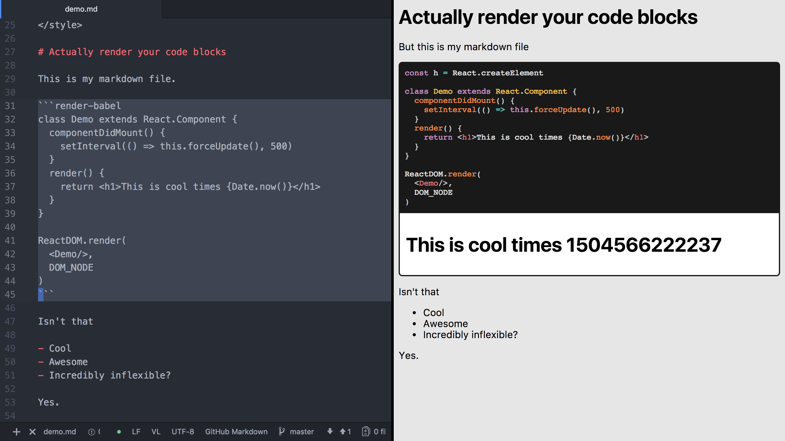

Render Markdown JavaScript
==========================

Renders markdown files to HTML with highlighted code blocks BUT ALSO RENDERS THE JAVASCRIPT ONES.



Why?
---

I've got a bunch of little JavaScript UI libs that don't need much more than a README.md for documentation, but a demo is worth a thousand README.md's, so I'd like the code in the README.md to actually render in a browser. Also great so people can copy/paste from the docs and *know* that it runs.

How?
----

Write normal markdown but for code fence blocks you want to have render in the browser also, use the "render" or "render-babel" language

```markdown
```render
console.log('lol!')
// also, here's the dom node to play with for just this code block:
console.log(DOM_NODE)
```
```

How do I get JavaScript and CSS onto the page?
----------------------------------------------

With `<script>`, `<link>`, and `<style>` of course.

```markdown
<script src="https://unpkg.com/react@15.6.1/dist/react.js"></script>
<script src="https://unpkg.com/react-dom@15.6.1/dist/react-dom.js"></script>
<link rel="stylesheet" type="text/css" href="https://unpkg.com/purecss@1.0.0/build/pure-min.css"/>
<style>body { color: red }</style>

Also check out the [demo.md](./demo.md) file from the screenshot.

# Then markdown as usual...
```

Does it babel?
--------------

Yes, first include babel standalone at the top of your markdown file and then use the `render-babel` language instead of `render`.

```markdown
<script src="https://unpkg.com/babel-standalone@6/babel.min.js"></script>

```render-babel
const JSX_IS_A_DSL_TOO_THO = <div>hi</div>
```
```

CLI Usage
---------

```sh
npm install render-markdown-js
render-markdown-js ./some-file.md > output.html
```

Node API Usage
--------------

```js
const rmj = require('render-markdown-js')
const html = rmj('#string of markdown')
```

Options
-------

There are none. Copy, paste, tweak.

Enjoy!
------

Please enjoy!
